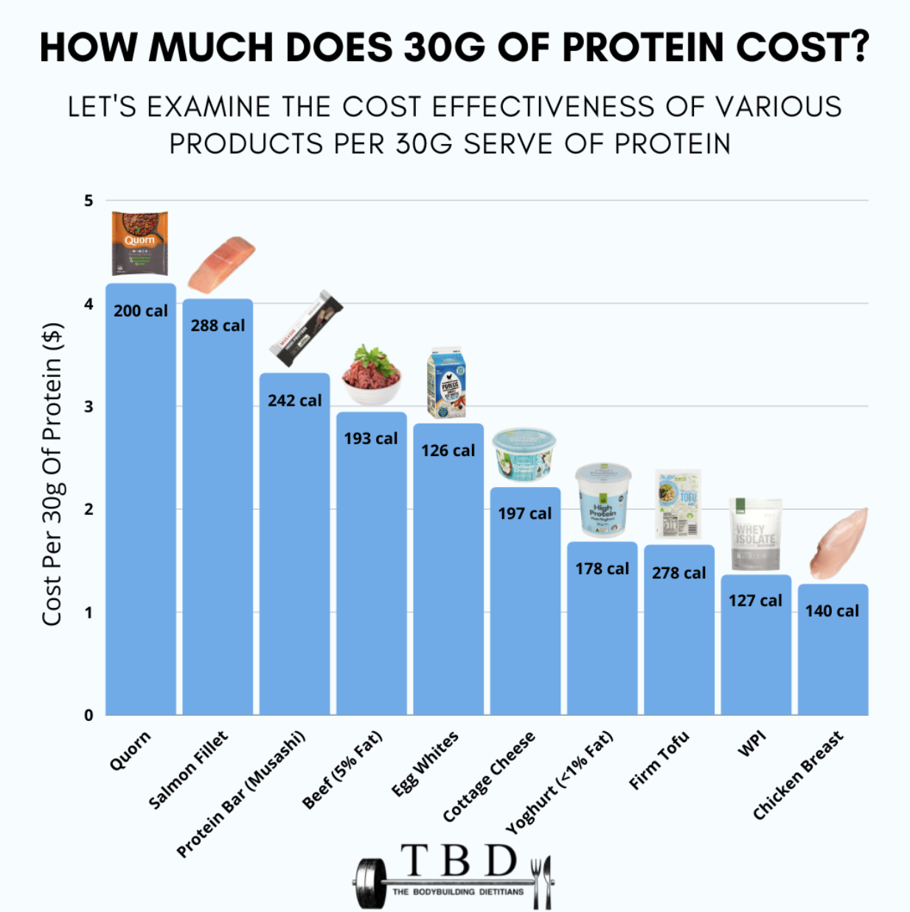
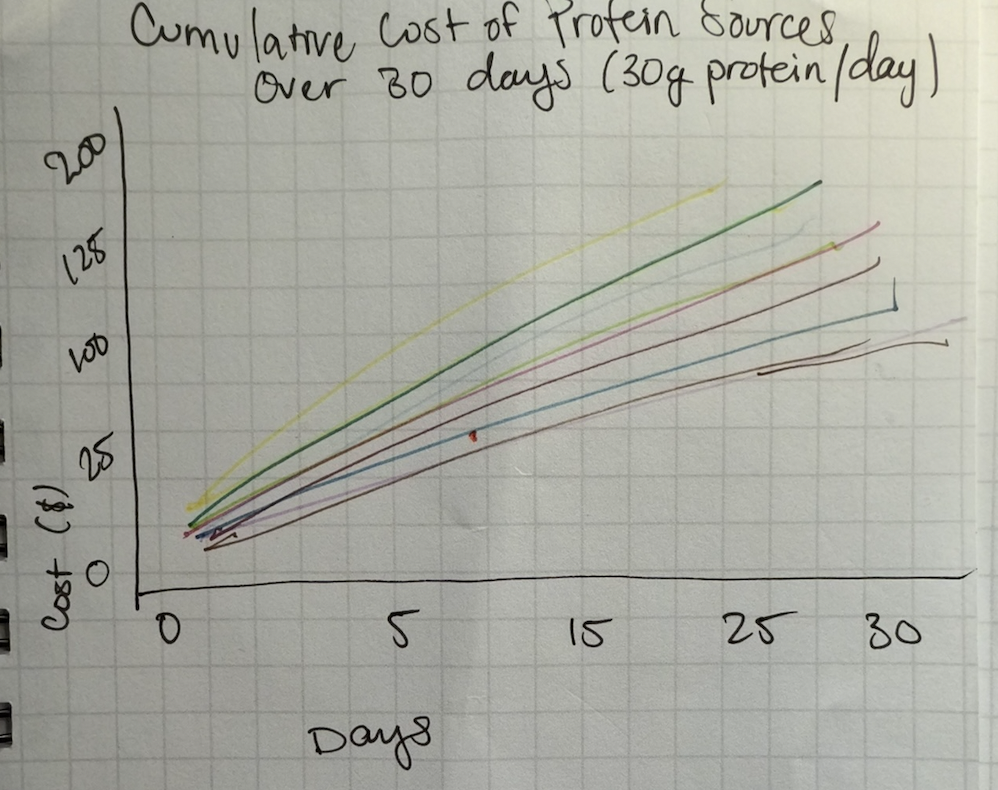

| [home page](https://lanayaojeda.github.io/lanayaoj-dataviz-portfolio/) | [data viz examples](dataviz-examples.md) | [critique by design](critique-by-design.md) | [final project I](final-project-part-one.md) | [final project II](final-project-part-two.md) | [final project III](final-project-part-three.md) |

# Visualizing Cost-Effective Protein: A Receipt-Inspired Approach (MakeoverMonday Redesign)

## Step one: the visualization

Source: [What Are The Cheapest High-Protein Foods? by The Bodybuilding Dietitians](https://www.thebodybuildingdietitians.com/blog/how-cost-effective-is-your-high-protein-diet)

The original visualization caught my eye with its blue bars and images, making it easy to compare food items without reading the x-axis labels. The title clarified that it was comparing the price per 30g of protein, but it didn’t fully communicate cost-effectiveness over time. It simply showed that 30g of salmon costs around $4, without illustrating the savings.  

The target audience seems to be fitness enthusiasts, particularly bodybuilders or dieters. While the visualization provides a basic cost comparison, it lacks depth. The most noticeable takeaway is that Quorn is the most expensive protein source, but price details are difficult to read. The inclusion of calorie information also adds clutter without contributing to the cost analysis.  

For my redesign, I wanted to focus on cost-effectiveness—showing which protein sources offer the best value. I removed unnecessary details and explored alternative chart types like bubble charts and bar graphs.

## Step two: the critique
- The visualization immediately caught my attention with its bold blue bars and images above them, making it easy to identify the food items being compared.
- The title was needed to clarify that the comparison was based on the cost of 30g of protein.
- While the design was visually engaging, it failed to effectively communicate cost-effectiveness over time, as it didn’t show how savings accumulated.
- The visualization only indicated that 30g of salmon cost around $4, without further context on cost savings.
- The primary audience for this tool seemed to be individuals in the fitness community, especially bodybuilders or those tracking protein intake.
- While the visualization succeeded in showing the cost of protein sources, it lacked the depth needed for it to be a truly useful tool.
- For instance, the price of Quorn was hard to read, and the inclusion of calorie information added clutter without contributing to the overall message.

## Step three: Sketch a solution

My initial idea was to focus on the relationship between price and time—specifically, which protein sources are the most cost-effective for consuming **30g of protein per day over 30 days**. I also wanted to remove irrelevant information, like calorie counts, and explore alternative visualizations such as a **line graph or stacked bar chart** to compare costs.  

## Step four: Test the solution

Questions: 

- Can you describe to me what this line chart is trying to communicate to you?

- What is your main takeaway from this?

- Is there a more effective way to display this for you to understand the message?

Results: 

After presenting my initial sketch in class, I realized several issues:  
- **The price increase was consistent and linear**, which made the trend predictable.  
- **Both the concept and graph were confusing** for my classmates.  
- **The visualization felt boring!** It didn’t engage or effectively communicate key insights.  

### First Round of Critique Insights:  
- A **clearer legend and labeling of protein sources** would improve readability.  
- **Distinguishing between animal-based and plant-based proteins** would help with comparison.  
- A **budget-focused approach** could make the visualization more intuitive.  
- A **tree map** might be a more effective way to represent "bang for your buck" over the course of a month.  

## Step five: build the solution

## New Approach & Execution  

After the critique, I explored how grocery budgets and protein intake visualizations are typically represented. I came across **Susie Lu’s receipt-style visualization** ([View here](https://www.susielu.com/data-viz/reviziting-the-receipt)) and thought it was very creative. I decided to apply the same concept to my grocery store protein purchases visualization to illustrate what it costs to buy **30g of different protein sources**.  

Since **Tableau’s design capabilities are limiting**, I created **bubble chart and bar graph visualizations** with my data, took screenshots, and then designed the receipt visualization in **Canva**.  

### User Testing Insights  

I tested the visualization with my roommates, and their feedback was positive:  

- **Bar Chart & Comparison:** *"It clearly shows the most expensive protein source and makes it easy to compare others against it."*  
- **Bubble Chart Interpretation:** *"At first, I was confused about the percentages, but then I saw the total at the bottom and assumed it represented the percentage of the total cost."*  

This process helped me refine how I represent **cost-effective protein sources**, making the data more engaging and easier to interpret. The **receipt-style visualization** turned out to be an effective and relatable way to present grocery costs.  

## References
- **Susie Lu** – *Reviziting the Receipt*: A creative approach to visualizing grocery costs that inspired my design. [View here](https://www.susielu.com/data-viz/reviziting-the-receipt).  

- **The Bodybuilding Dietitians** – *How Cost-Effective is Your High-Protein Diet?*: Provided insights into evaluating protein costs. [Read here](https://www.thebodybuildingdietitians.com/blog/how-cost-effective-is-your-high-protein-diet).  
