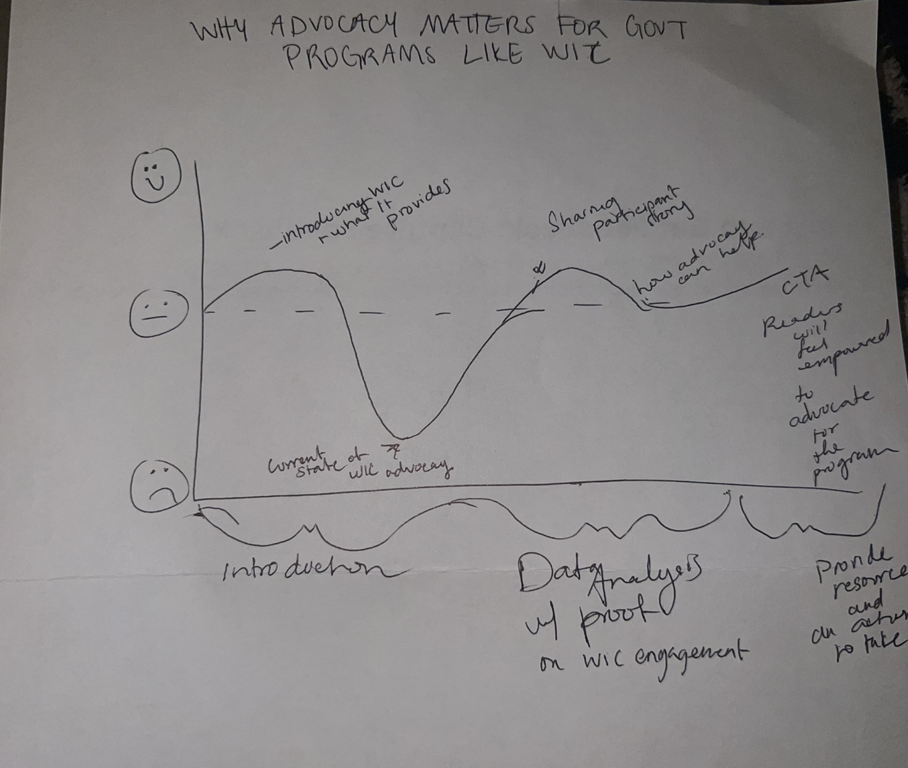
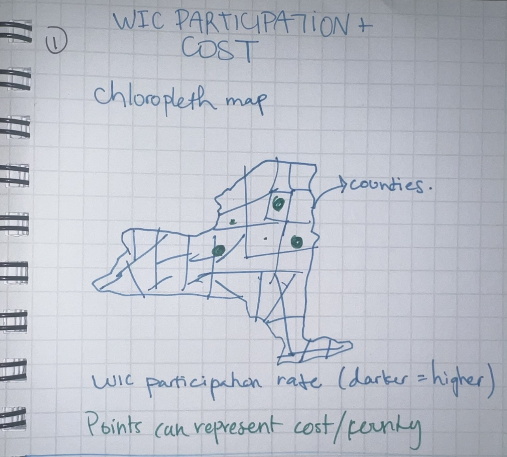
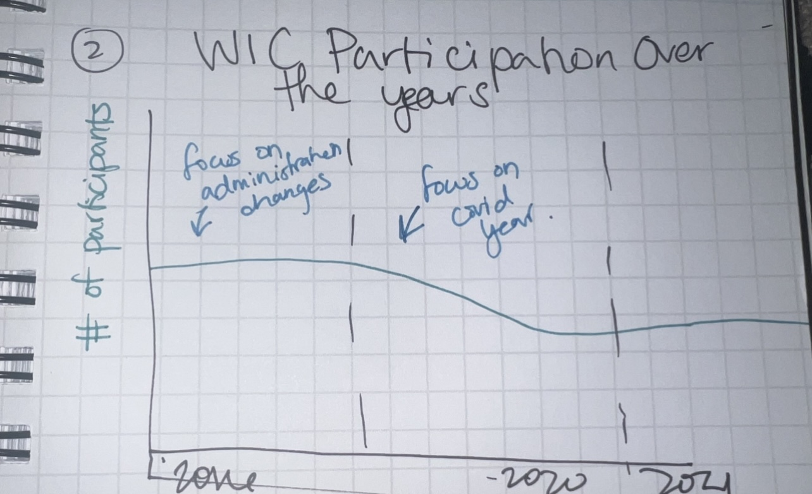

| [home page](https://lanayaojeda.github.io/lanayaoj-dataviz-portfolio/) | [data viz examples](dataviz-examples.md) | [critique by design](critique-by-design.md) | [final project I](final-project-part-one.md) | [final project II](final-project-part-two.md) | [final project III](final-project-part-three.md) |

# Outline
This project explores how low engagement and limited advocacy for the WIC (Women, Infants, and Children) program in New York State has led to decreased participation and shrinking government funding. Through storytelling, user insights, and data visualizations, the goal is to raise awareness of this issue and encourage community members to advocate for WIC by engaging with the WIC Association of New York State and becoming a part of their advocating efforts.

> Structure

### Story Arc

1. **Introduction to WIC**  
   What WIC is, who it supports, and why it's vital for families—especially immigrants and low-income households.

2. **The Problem**  
   Participation has dropped significantly, particularly during the Trump administration and COVID-19. This decline has resulted in budget cuts and reduced reach.

3. **Personal Story**  
   Share Anna's story—a young mother who relied on WIC, faced barriers, but built community through it.

4. **The Power of Advocacy**  
   Highlight the importance of local voices, the role of WICANYS, and how policy changes can occur when people get involved.

5. **Call to Action**  
   Empower readers with tangible steps to engage:
   - Learn about advocacy initiatives through WICANYS
   - Call legislators to advocate for a higher WIC budget
   - Follow and engage with WICANYS channels

## Initial sketches

### 1. New York State WIC Coverage Map  
- **Concept:** NYS map with only a few counties or service sites “lit up”  
- **Message:** Visualize discrepancies in engagement or underreported counties  
- **Goal:** Show where advocacy and outreach are most needed

### 2. Line Graph: Participation Trends Over Time  
- **Concept:** Line chart tracking WIC participation from 2016 to 2021, highlighting declines during the 2016 administration and COVID-19 pandemic  
- **Data Source:** Participation data from NYC and USDA  
- **Goal:** Visualize the long-term trend and correlate major policy changes and public health crises with drops in enrollment or engagement   

# The data
To inform my visualizations of WIC participation and funding in New York State, I’ll use three key data sources. The USDA WIC Program Participation & Costs dataset provides trends in enrollment and spending at both state and national levels. I feel like I can use the national data to make more statements about WIC and comparre to NYS and how their funding is decided upon. The Data.gov WIC Participation and Cost Data offers additional state-by-state comparisons. Lastly, the WIC Program Grant Levels data will help visualize funding distribution by fiscal year, allowing me to explore correlations between grant levels and participation across regions.

| Name  | URL | Description |
|------|-----|-------------|
| USDA WIC Program Participation & Costs   |   [Link](https://www.fns.usda.gov/pd/wic-program)  |   Data tables on participation, food costs, admin and nutrion services costs, per state and nationally. |
| WIC Participation and Cost Data on Data.gov  |  [Link](https://catalog.data.gov/dataset/women-infants-and-children-wic-participating-and-cost-data)  |  Data on WIC participation and cost data for all 50 states  |
|   WIC Program Grant Levels  |  [LINK](https://www.fns.usda.gov/wic/program-grant-levels)     |  WIC grant levels by fiscal year and state agency.  |

# Method and medium
- **Tools:** Shorthand for narrative storytelling; Tableau for interactive and accessible visualizations  
- **Audience:** Residents of New York State, state advocates and partners, state legislators, and WIC participants  

## References
Data.gov. (2024). Women, Infants, and Children (WIC) Participating and Cost Data. Data.gov. https://catalog.data.gov/dataset/women-infants-and-children-wic-participating-and-cost-data

USDA. (n.d.). WIC Program Grant Levels by Fiscal Year | Food and Nutrition Service. Www.fns.usda.gov. https://www.fns.usda.gov/wic/program-grant-levels

USDA. (2019). WIC program | Food and nutrition service. Usda.gov. https://www.fns.usda.gov/pd/wic-program
